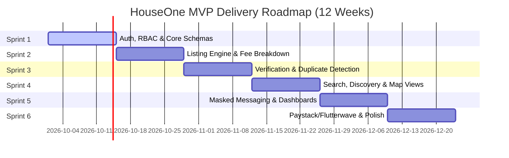

# HouseOne — Agile Product Backlog & Sprint Roadmap 📋

> **Document Version:** 1.0  
> **Source Reference:** [HouseOne BRD v1.0](BRD.md)  
> **Methodology:** Scrum / Agile (2-week sprint cycles)  
> **Target Timeline:** 6 Sprints (12 Weeks to MVP Launch)

---

## 📑 Table of Contents
1. [Epics & Thematic Structure](#1-epics--thematic-structure)
2. [Release & Sprint Roadmap Overview](#2-release--sprint-roadmap-overview)
3. [Definition of Ready (DoR) & Definition of Done (DoD)](#3-definition-of-ready-dor--definition-of-done-dod)
4. [Sprint Breakdown & Story Allocations](#4-sprint-breakdown--story-allocations)
   - [Sprint 1: Architecture, Authentication & RBAC](#sprint-1-weeks-1-2-architecture-auth--rbac)
   - [Sprint 2: Property Listing Engine & Nigerian Fee Structure](#sprint-2-weeks-3-4-property-listing-engine--nigerian-fee-structure)
   - [Sprint 3: Verification Engine, Anti-Duplicate & Admin Moderation](#sprint-3-weeks-5-6-verification-engine-anti-duplicate--admin-moderation)
   - [Sprint 4: Search & Discovery, Maps & Saved Alerts](#sprint-4-weeks-7-8-search--discovery-maps--saved-alerts)
   - [Sprint 5: Masked Communication, Inspection Scheduler & Dashboards](#sprint-5-weeks-9-10-masked-communication-inspection-scheduler--dashboards)
   - [Sprint 6: Monetisation (Paystack/Flutterwave), Reviews & Launch Hardening](#sprint-6-weeks-11-12-monetisation-paystackflutterwave-reviews--launch-hardening)
5. [Complete Traceability Matrix (52 User Stories)](#5-complete-traceability-matrix-52-user-stories)

---

## 1. Epics & Thematic Structure

| Epic ID | Epic Title | Primary User Roles | BRD Modules | Total Story Points |
|---|---|---|---|---|
| **EPIC-01** | **Identity, Authentication & RBAC** | All Roles, Admins | Mod 1, 2, 3 | 34 SP |
| **EPIC-02** | **Property Catalog & Nigerian Listing Engine** | Landlords, Agents, PMs | Mod 4, 6 | 42 SP |
| **EPIC-03** | **Verification Engine & Trust Architecture** | Landlords, Agents, Moderators | Mod 7, 10 | 38 SP |
| **EPIC-04** | **Duplicate Detection & Fraud Safeguards** | Seekers, Moderators, Admins | Mod 4, 10, 12 | 26 SP |
| **EPIC-05** | **Search, Discovery & Geo-Location** | Seekers, Guests | Mod 5, 6 | 32 SP |
| **EPIC-06** | **In-App Messaging & Inspection Scheduler** | Seekers, Landlords, Agents | Mod 11 | 29 SP |
| **EPIC-07** | **Role-Specific Dashboards & Management** | Landlords, Agents, PMs, Admins | Mod 8, 9, 10 | 35 SP |
| **EPIC-08** | **Monetisation, Gateways & Billing** | Agents, PMs, Finance Officers | Mod 13 | 31 SP |
| **EPIC-09** | **Verified Reviews, Ratings & Social Proof** | Verified Seekers, Admins | Mod 12 | 18 SP |
| **EPIC-10** | **Analytics, Audit Logging & Compliance** | Admins, Finance, All | Mod 14, 15, NFR | 27 SP |
| **Total** | | | | **312 SP** |

---

## 2. Release & Sprint Roadmap Overview

---

## 3. Definition of Ready (DoR) & Definition of Done (DoD)

### Definition of Ready (DoR)
* Story is written in standard user story format (`As a... I want to... So that...`).
* Gherkin acceptance criteria (`Given / When / Then`) are explicitly defined.
* Dependencies on preceding functional requirements or API endpoints are identified.
* UI wireframe / mockup reference is linked where applicable.
* Story points (Fibonacci) estimated and agreed upon by the engineering team.

### Definition of Done (DoD)
* Code implementation meets all specified acceptance criteria.
* Unit & integration tests written with ≥ 70% coverage on core transactional workflows.
* API endpoints documented (OpenAPI/Swagger) and enforce RBAC permissions.
* Passed peer code review.
* Verified in staging environment matching mobile and desktop responsive viewports.
* NDPA privacy checks (PII masking and audit logs) verified.

---

## 4. Sprint Breakdown & Story Allocations

---

### Sprint 1 (Weeks 1-2): Architecture, Auth & RBAC
**Goal:** Establish the foundational backend/frontend infrastructure, multi-role registration, secure authentication, OTP verification, and RBAC matrix.

| Ticket ID | BRD Ref | Story & Description | Priority | SP |
|---|---|---|---|---|
| **HO-101** | `FR-REG-001` | **Role-Based Registration** As a user, I want to select my account type (Seeker, Landlord, Agent, Property Manager) during sign-up so my dashboard matches my persona. | Must Have | 5 |
| **HO-102** | `FR-REG-002` | **OTP Email & SMS Verification** As a registering user, I want to receive a 6-digit OTP via SMS/Email to verify my contact details within 60s (expires 10m). | Must Have | 5 |
| **HO-103** | `FR-REG-003` | **OAuth Social Sign-Up (Google/Apple)** As a seeker, I want to sign up via Google/Apple and add my phone number for OTP 2FA. | Should Have | 5 |
| **HO-104** | `FR-REG-004` | **Agent & Property Manager CAC/License Upload** As an estate agent, I want to upload my CAC certificate and ID so my account can be approved. | Must Have | 5 |
| **HO-105** | `FR-AUTH-001` | **User Login & Session Management** As a user, I want to log in securely with lockout protection after 5 failed attempts (15-min lockout). | Must Have | 3 |
| **HO-106** | `FR-AUTH-002` | **Password Reset with Time-Limited Token** As a user, I want to request a single-use 15-minute password reset link or OTP. | Must Have | 3 |
| **HO-107** | `FR-AUTH-003` | **Mandatory MFA for Admin Portal** As a security officer, I want MFA enforced on all Admin/Moderator/Finance accounts. | Must Have | 5 |
| **HO-108** | `FR-PROF-001` | **User Profile Management** As a user, I want to update my profile photo, name, and preferred locations. | Must Have | 3 |

*Sprint 1 Velocity Target:* **34 SP**

---

### Sprint 2 (Weeks 3-4): Property Listing Engine & Nigerian Fee Structure
**Goal:** Implement property creation with Nigerian-specific pricing itemisation (Rent, Caution, Service, Agency, Legal), location taxonomy, and media uploads.

| Ticket ID | BRD Ref | Story & Description | Priority | SP |
|---|---|---|---|---|
| **HO-201** | `FR-LIST-001` | **Nigerian Property Taxonomy & Hierarchy** As a landlord/agent, I want to specify Nigerian location hierarchy (State, LGA, Area, Street, Landmark, GPS Pin). | Must Have | 5 |
| **HO-202** | `FR-LIST-001` | **Itemised Pricing Breakdown Component** As a listing creator, I want to capture Rent, Service Charge, Caution Fee, Agency Fee (%), and Legal Fee (%) with calculated total first-year cost. | Must Have | 8 |
| **HO-203** | `FR-LIST-003` | **Multi-Image Media Upload with Auto-Compression** As an owner, I want to upload 3 to 25 photos with CDN optimization and thumbnail generation. | Must Have | 5 |
| **HO-204** | `FR-LIST-001` | **Property Specs & Amenities Checklist** As an owner, I want to select room counts, property type (Self-con, Flat, Duplex, Short-let), and amenities (Generator, Security, Pre-paid Meter, etc.). | Must Have | 5 |
| **HO-205** | `FR-LIST-004` | **60-Day Listing Expiry Engine** As a system, I want to automatically expire listings after 60 days with 7-day and 0-day renewal notifications (`BR-006`). | Must Have | 5 |
| **HO-206** | `FR-LIST-005` | **Mark as Rented / Delete Workflow** As an owner, I want to mark a property as "Let" or delete it with a mandatory exit reason (`BR-007`). | Must Have | 3 |
| **HO-207** | `FR-LND-001` | **Landlord Free Listing Limit Enforcement** As a system, I want to restrict free-tier landlords to 1 active listing and prompt for upgrade on a 2nd submission (`BR-008`). | Must Have | 5 |
| **HO-208** | `FR-AGT-002` | **Listing Edit & Re-Verification Trigger** As a system, I want price or location edits on Verified listings to automatically revert status to Pending Review (`BR-001`). | Must Have | 6 |

*Sprint 2 Velocity Target:* **42 SP**

---

### Sprint 3 (Weeks 5-6): Verification Engine, Anti-Duplicate & Admin Moderation
**Goal:** Deliver the core trust layer: document review pipeline, physical/virtual inspection scheduling SLA, duplicate listing detection, and Admin moderation console.

| Ticket ID | BRD Ref | Story & Description | Priority | SP |
|---|---|---|---|---|
| **HO-301** | `FR-VER-001` | **Title & Mandate Document Submission** As a listing owner, I want to upload C of O, Survey Plan, Deed, or Letter of Authority (PDF/JPG up to 10MB) for verification. | Must Have | 5 |
| **HO-302** | `FR-VER-002` | **Inspection Assignment & 5-Day SLA Tracker** As a verification officer, I want to schedule and record physical/virtual inspection outcomes within 5 business days. | Must Have | 8 |
| **HO-303** | `FR-VER-003` | **Verified Badge Issuance & Rejection Flow** As a Moderator, I want to grant green Verified badges or reject with documented reason codes allowing 1 resubmission (`BR-003`). | Must Have | 5 |
| **HO-304** | `FR-LIST-002` | **Automated Duplicate Listing Detection** As a system, I want to flag listings within 50m GPS distance and ≤5% price variance as possible duplicates (`BR-004`). | Must Have | 8 |
| **HO-305** | `FR-LIST-002` | **Agent Mandate Conflict Resolution** As a Moderator, I want to review conflicting agent claims and enforce Letter of Authority checks (`BR-005`). | Must Have | 5 |
| **HO-306** | `FR-ADM-001` | **Moderator Portal: Listing & Document Queue** As a Moderator, I want a single queue to review pending listings and verify documents chronologically. | Must Have | 8 |
| **HO-307** | `FR-ADM-001` | **Immutable Administrative Audit Log** As a Super Admin, I want every approval, rejection, and suspension logged immutably with timestamp and actor ID. | Must Have | 5 |

*Sprint 3 Velocity Target:* **44 SP**

---

### Sprint 4 (Weeks 7-8): Search & Discovery, Maps & Saved Alerts
**Goal:** High-speed search filtering, verified-first sorting, map integration, comprehensive details page, and saved-search notification triggers.

| Ticket ID | BRD Ref | Story & Description | Priority | SP |
|---|---|---|---|---|
| **HO-401** | `FR-SRCH-001` | **Multi-Attribute Search & Filter Pipeline** As a seeker, I want to filter listings by State, LGA, Price Range, Bedrooms, and Verified-only in ≤ 2 seconds. | Must Have | 8 |
| **HO-402** | `FR-SRCH-002` | **Verified-First & Custom Sorting** As a seeker, I want search results ordered with Verified listings first by default, with options for Price Low-High/High-Low. | Must Have | 3 |
| **HO-403** | `FR-DTL-001` | **Full Property Details Page & Gallery** As a seeker, I want a responsive detail page with photo gallery, itemised fee table, and nearby amenities. | Must Have | 5 |
| **HO-404** | `FR-DTL-001` | **Interactive Map & POI Markers** As a seeker, I want to view the property's map pin and nearby schools/hospitals/transit options. | Should Have | 5 |
| **HO-405** | `FR-DTL-001` | **Contact Masking & Auth Gating** As a system, I want landlord contact details hidden from unauthenticated guests until they register (`BR-011`). | Must Have | 5 |
| **HO-406** | `FR-PROF-002` | **Favourites & Saved Searches (Max 20/50)** As a seeker, I want to bookmark favourite properties and save search criteria for 1-click execution. | Must Have | 3 |
| **HO-407** | `FR-SRCH-003` | **Daily Batched Saved-Search Email Alerts** As a system, I want to send at most one batched email alert per day for newly matching listings. | Should Have | 5 |
| **HO-408** | `FR-DTL-003` | **Similar Verified Properties Carousel** As a seeker, I want to view 3-8 similar verified properties in the same price/neighbourhood tier. | Could Have | 3 |

*Sprint 4 Velocity Target:* **37 SP**

---

### Sprint 5 (Weeks 9-10): Masked Communication, Inspection Scheduler & Dashboards
**Goal:** Secure in-platform messaging with phone privacy, inspection booking calendar, WhatsApp deep-links, and dedicated role dashboards for Landlords and Agents.

| Ticket ID | BRD Ref | Story & Description | Priority | SP |
|---|---|---|---|---|
| **HO-501** | `FR-COM-001` | **Masked In-App Messaging Thread** As a seeker/landlord, I want to message within the platform without exposing phone numbers until mutual consent (`BR-010`). | Must Have | 8 |
| **HO-502** | `FR-COM-001` | **WhatsApp Click-to-Chat Deep-Link** As a seeker, I want to click WhatsApp on an active listing with auto-filled listing ID and title reference. | Must Have | 3 |
| **HO-503** | `FR-COM-002` | **Inspection Appointment Scheduler & 24h SLA** As a seeker, I want to propose inspection slots that owners must confirm/decline within 24 hours. | Should Have | 8 |
| **HO-504** | `FR-AGT-001` | **Agent Command Center Dashboard** As an agent, I want a unified view of active listings, weekly leads (calls/WhatsApp/chat), and subscription quota. | Must Have | 8 |
| **HO-505** | `FR-LND-002` | **Landlord Tenant Enquiry Inbox** As a landlord, I want to manage prospective tenant enquiries categorized by status (New, Contacted, Closed). | Should Have | 5 |
| **HO-506** | `FR-LND-001` | **Property Manager Multi-Staff Delegation** As a Property Manager, I want to delegate specific listing portfolios to sub-staff accounts under one company ID. | Could Have | 5 |
| **HO-507** | `FR-REV-002` | **1-Click Fraud Reporting & 3-Report Auto-Suspension** As a seeker, I want to report fake listings; system auto-suspends listings after 3 independent reports (`BR-014`). | Must Have | 5 |

*Sprint 5 Velocity Target:* **42 SP**

---

### Sprint 6 (Weeks 11-12): Monetisation (Paystack/Flutterwave), Reviews & Launch Hardening
**Goal:** Payment gateway integration, subscription billing, 7-day featured listing boosts, verified reviews, analytics, and NDPA compliance audits.

| Ticket ID | BRD Ref | Story & Description | Priority | SP |
|---|---|---|---|---|
| **HO-601** | `FR-SUB-003` | **Paystack & Flutterwave Payment Gateway Integration** As a user, I want to pay for subscriptions and listing promotions securely via Card, Bank Transfer, or USSD. | Must Have | 8 |
| **HO-602** | `FR-SUB-001` | **Tiered Subscription Plans for Agents (Basic/Pro/Enterprise)** As an agent, I want to subscribe to tiered monthly/annual plans unlocking higher listing quotas. | Must Have | 5 |
| **HO-603** | `FR-SUB-002` | **Featured / Sponsored Listing Placement** As an owner, I want to buy 7/30-day top-of-search featured placement (max 20 per region). | Should Have | 5 |
| **HO-604** | `FR-REV-001` | **Post-Transaction Verified Renter Reviews** As a verified tenant, I want to rate landlords/agents (1-5 stars) after confirmed inspection/tenancy. | Should Have | 5 |
| **HO-605** | `FR-ADM-003` | **Finance Gateway Reconciliation & Export** As a Finance Officer, I want nightly payment reconciliation matching gateway settlement logs and CSV export. | Should Have | 5 |
| **HO-606** | `FR-ANL-001` | **Platform Executive & Search Analytics Dashboard** As an admin, I want to monitor MAU, search heatmaps by LGA, conversion rates, and revenue. | Should Have | 5 |
| **HO-607** | `FR-SUP-002` | **Customer Support Ticket Escalation System** As a support agent, I want to escalate tickets to Moderators with full message history intact. | Must Have | 5 |
| **HO-608** | `NFR-PRIV-001` | **NDPA 2023 Compliance & Data Export/Deletion** As a compliance officer, I want automated PII anonymization and user data export/deletion workflows. | Must Have | 5 |

*Sprint 6 Velocity Target:* **43 SP**

---

## 5. Complete Traceability Matrix (52 User Stories)

| Story ID | Persona | Summary Description | Module | Priority | Target Sprint |
|---|---|---|---|---|---|
| **US-01** | Seeker | Search by location and budget | Search (Mod 5) | Must Have | Sprint 4 |
| **US-02** | Seeker | Filter Verified-only listings | Search (Mod 5) | Must Have | Sprint 4 |
| **US-03** | Seeker | View gallery and video tour | Details (Mod 6) | Must Have | Sprint 4 |
| **US-04** | Seeker | Save favourites | Profile (Mod 3) | Must Have | Sprint 4 |
| **US-05** | Seeker | Saved-search alert notifications | Search (Mod 5) | Should Have | Sprint 4 |
| **US-06** | Seeker | WhatsApp/Call direct contact | Details (Mod 6) | Must Have | Sprint 5 |
| **US-07** | Seeker | Report fraudulent listing | Reviews (Mod 12) | Must Have | Sprint 5 |
| **US-08** | Seeker | Book inspection appointment online | Comm (Mod 11) | Should Have | Sprint 5 |
| **US-09** | Seeker | Leave verified review post-tenancy | Reviews (Mod 12) | Should Have | Sprint 6 |
| **US-10** | Seeker | Compare similar properties nearby | Details (Mod 6) | Could Have | Sprint 4 |
| **US-11** | Seeker | Google single-click sign-up | Reg (Mod 1) | Should Have | Sprint 1 |
| **US-12** | Seeker | Password reset via OTP/link | Auth (Mod 2) | Must Have | Sprint 1 |
| **US-13** | Seeker | Granular notification preferences | Profile (Mod 3) | Should Have | Sprint 1 |
| **US-14** | Seeker | Upfront Nigerian fee itemisation | Details (Mod 6) | Must Have | Sprint 2 |
| **US-15** | Seeker | Location map & nearby POIs | Details (Mod 6) | Should Have | Sprint 4 |
| **US-16** | Landlord | Create listing with full specs | Listing (Mod 4) | Must Have | Sprint 2 |
| **US-17** | Landlord | Upload title deeds for verification | Verif (Mod 7) | Must Have | Sprint 3 |
| **US-18** | Landlord | Manage enquiries inbox | Landlord (Mod 9) | Must Have | Sprint 5 |
| **US-19** | Landlord | Mark property as rented/let | Listing (Mod 4) | Must Have | Sprint 2 |
| **US-20** | Landlord | 60-day renewal reminder | Listing (Mod 4) | Must Have | Sprint 2 |
| **US-21** | Landlord | View 30-day listing view analytics | Analytics (Mod 14) | Should Have | Sprint 5 |
| **US-22** | Landlord | Upgrade plan when exceeding 1 free listing | Landlord (Mod 9) | Should Have | Sprint 2 |
| **US-23** | Landlord | Mask phone number during chat | Comm (Mod 11) | Should Have | Sprint 5 |
| **US-24** | Landlord | Edit listing (trigger re-verification) | Listing (Mod 4) | Must Have | Sprint 2 |
| **US-25** | Landlord | View verification rejection reasons | Verif (Mod 7) | Must Have | Sprint 3 |
| **US-26** | Agent | Register agency & upload CAC | Reg (Mod 1) | Must Have | Sprint 1 |
| **US-27** | Agent | Central multi-listing dashboard | Agent (Mod 8) | Must Have | Sprint 5 |
| **US-28** | Agent | Listing performance analytics | Agent (Mod 8) | Should Have | Sprint 5 |
| **US-29** | Agent | Buy 7-day featured promotion | Monetisation (Mod 13) | Should Have | Sprint 6 |
| **US-30** | Agent | Receive duplicate listing notification | Listing (Mod 4) | Must Have | Sprint 3 |
| **US-31** | Agent | Upgrade agent subscription tier | Monetisation (Mod 13) | Should Have | Sprint 6 |
| **US-32** | Agent | Track conversion leads (Calls/WhatsApp) | Agent (Mod 8) | Should Have | Sprint 5 |
| **US-33** | PM | Manage multi-property company portfolio | Landlord (Mod 9) | Must Have | Sprint 5 |
| **US-34** | PM | Portfolio performance reports | Analytics (Mod 14) | Should Have | Sprint 5 |
| **US-35** | PM | Bulk property upload via spreadsheet | Listing (Mod 4) | Could Have | Sprint 6 |
| **US-36** | Moderator | Review new listings before publishing | Admin (Mod 10) | Must Have | Sprint 3 |
| **US-37** | Moderator | Approve/reject verification badges | Verif (Mod 7) | Must Have | Sprint 3 |
| **US-38** | Moderator | Suspend fraudulent listings in <1m | Admin (Mod 10) | Must Have | Sprint 3 |
| **US-39** | Support | View complete user ticket history | Support (Mod 15) | Must Have | Sprint 6 |
| **US-40** | Support | Escalate complaint to Moderator | Support (Mod 15) | Must Have | Sprint 6 |
| **US-41** | Finance | Monthly revenue reconciliation report | Admin (Mod 10) | Must Have | Sprint 6 |
| **US-42** | Finance | Track failed gateway retry attempts | Monetisation (Mod 13) | Should Have | Sprint 6 |
| **US-43** | Super Admin | Manage staff roles and RBAC | Admin (Mod 10) | Must Have | Sprint 1 |
| **US-44** | Super Admin | Inspect immutable audit logs | Admin (Mod 10) | Must Have | Sprint 3 |
| **US-45** | Super Admin | Configure system parameters dynamically | Admin (Mod 10) | Should Have | Sprint 3 |
| **US-46** | Seeker | Browse as guest before registration | Search (Mod 5) | Must Have | Sprint 4 |
| **US-47** | Seeker | Mobile-responsive touch experience | NFR (Mod 8) | Must Have | Sprint 4 |
| **US-48** | Seeker | Live chat support widget | Support (Mod 15) | Should Have | Sprint 6 |
| **US-49** | Admin | Executive conversion & search analytics | Analytics (Mod 14) | Should Have | Sprint 6 |
| **US-50** | PM | Delegate listings to company sub-agents | Landlord (Mod 9) | Could Have | Sprint 5 |
| **US-51** | Agent | 7-day listing expiry reminder | Listing (Mod 4) | Must Have | Sprint 2 |
| **US-52** | Seeker | Unverified listing warning disclaimer | Details (Mod 6) | Should Have | Sprint 4 |
